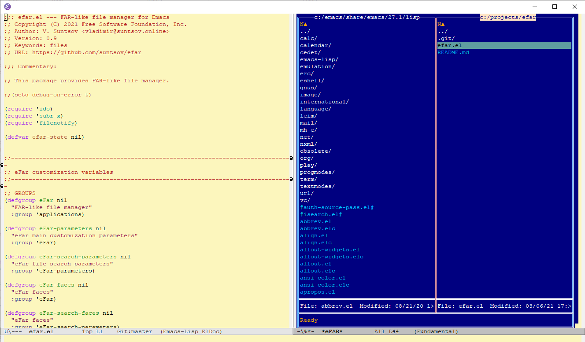

[](https://melpa.org/#/efar) [](https://stable.melpa.org/#/efar)

# eFar

This package provides FAR-like file manager for Emacs.



## Please note!
In version 1.26 some default eFar key bindings have been changed according to the [Emacs Key Binding Conventions](https://www.gnu.org/software/emacs/manual/html_node/elisp/Key-Binding-Conventions.html).  

Actual key bindings you can check by **C-e ? (M-x efar-do-show-help)**  

In case if you'd like to get back to previous configuration you can load [get-back-keys.el](adds/get-back-keys.el) in your Emacs init file.

The way of key binding customization has been also changed. Please read **How to customize eFar key bindings?** below.

## Requirements
* Emacs 26.1 or newer.

## Installation
* Manually: download efar.el and add the location to load path.
* From melpa: ensure you have melpa in your package-archives (see Melpa Installation). Then, **M-x package-install [RET] efar**

## Usage
To start eFar just type **M-x efar**.

When Efar is called with universal argument, default-directory of actual buffer is automatically opened in left panel - **C-u M-x efar**.

## Changelog
See [NEWS.md](NEWS.md).

## Features

### Navigation
* move cursor - **\<up\>, \<down\>, \<left\>, \<right\>**
* go to first/last file in current directory - **\<home\>/\<end\> or \<C-left\>/\<C-right\>**
* enter directory under cursor - **RET**
* switch to other panel - **TAB**
* open current directory in other panel - **C-c TAB**
* fast navigation to the file with specific name in current directory - **just start typing any part of file name**
* you also can include \'*\' into the search string, then search string is used as a wildcard
* **C-s/C-r** to go to next/previous occurrence, **C-g** to quit fast search mode
* go to the given directory - **C-e c d**
* go to the parent directory - **\<C-up\>**

### Appearance
* change mode double-panel <-> single-panel - **C-e v M**
* change number of columns in current panel - **C-e v +   or   C-e v -**
* change file display mode (short, long, detailed, full) - **C-e v m**
* Press **\<C-t\>** to switch color theme. For now four themes available: blue, black, white and sand.

### Selecting disks (Windows) or mount points (Unix)
* display list of available disks (Windows) or mount points (Unix) - **C-e f d**

### Edit and auto preview
* open file under cursor in other buffer and switch to that buffer - **\<f4\>**
* open file under cursor in other buffer and keep eFar buffer actual - **\<f3\>**
* open file under cursor in external application - **\<M-f4\>**
* directories and files of predefined types are automatically opened in other buffer when navigating through the file list - this function can configured via customization
 
### File operations
* mark file under cursor - **\<insert\>**
* unmark all marked files - **\<C-insert\>**
* copy marked files (or file under cursor if no files marked) - **C-e \<f5\>\<f5\>**
* move marked files (or file under cursor if no files marked) - **C-e \<f6\>\<f6\>**
* delete marked files (or file under cursor if no files marked) - **C-e \<f8\>\<f8\>**
* create new directory - **C-e \<f7\>\<f7\>**
* create new file - **C-x C-f**
* show statistic (size, number of file and directories) for the directory under cursor - **C-e c s**
* run ediff for selected files - **C-e c e**
* copy to the clipboard path to the file under cursor - **C-e c p**
* change file modes (permissions) for selected files - **C-e f m**

### Batch file renaming
eFar has a very simple batch file renamer
* Press **C-e c n** to run it.
* The files to rename are the marked ones (if any) or the whole (might be filtered) file list in the current directory.
* Renamer asks for a format string to use for renaming, default to #basename-#number#ext
* Possible keywords in the format string:
  - #name - replaced by the whole file name including extension
  - #basename - replaced by the file name without extension
  - #ext - replaced by the file extension (if any) with leading '.'
  - #number - replaced by the running number
* Keyword can be written in different form:
  - \<name\>, \<NAME\> or \<Name\>
* Depending on the form corresponding part will be translated to lower case, upper case or will be capitalized.

Preliminary results of renaming are shown in a separate buffer.
User can run actual renaming or cancel it.

### Batch regexp replace in files
* press **C-e c r** to start batch regexp replace in selected files
* The files to replace in are the marked ones (if any) or the whole (might be filtered) file list in the current directory 

### Changing sort order, filtering
* change sort order and direction - **C-e f s**
* set/remove filtering by file mask - **C-e f f**

### File search
* start search in current directory - **C-e \<M-f7\>**
* display last search results - **C-e \<S-f7\>**
* go to the file from search result list - **RET**
* show buffer with detailed search results - **C-e \<C-M-f7\>**
* open list with last search queries - **C-e \<C-f7\>**
* it's possible to search for text in files using simple string or Emacs regular expressions
* when opening file from the file search results an incremental search is automatically activated for the searched text
* no external tools used for search functionality, it's completely implemented using pure elisp
* multiprocessing used when searching for text inside files

### Directory comparison
* start comparing directories selected in right and left panels - **C-e \<M-f6\>**
* display last comparison results - **\<S-f6\>**
* display comparison results with details in a separate buffer - **C-e \<C-M-f6\>**
* show/hide unchanged files - **C-e \<f6\> a**
* togle displaying difference in size - **C-e \<f6\> s**
* togle displaying difference in modes - **C-e \<f6\> m**
* togle displaying difference in owner - **C-e \<f6\> o**
* togle displaying difference in group - **C-e \<f6\> g**
* togle displaying difference in checksum - **C-e \<f6\> h**
* new files are marked in green, deleted ones in red and changed in blue
* multiprocessing used when coparing directories

### Last visited directories
* display list of last visited directories - **C-e c h**
* go to the directory from the list of last visited directories - **RET**
* when panel is in file mode you can loop over last visited directories by **\<C-M-up\>** and **\<C-M-down\>**

### Panel mode selector
* Selector of available panel modes can be displayed by **C-e c m**
* Current panel is switched to selected mode

### Bookmarks
* add file/directory under cursor to bookmark list - **C-e c B**
* display bookmarks - **C-e c b**
* remove item from the list of bookmarks - **C-e \<f8\>\<f8\>**
* go to to the item from bookmark list - **RET**

### Save/restore state
* by default state is saved automatically on exit or when eFar buffer is killed and restored when Efar is opened again

### Auto refresh when files change
* eFar buffer is automatically refreshed when content of displayed directories changes in outside world

### Mouse interaction 
Many operations within eFar buffer can be performed using mouse
* Drag&Drop file items within eFar buffer to move them from one place to another
* use **C-** modifier when dragging to copy files instead of moving
* double click to enter directory
* Right-click (mouse-3) or use **C-** and **S-** modifiers with left-click to mark files
* click on the directory name at top to show disk/mout mount selector
* use controls in the panel header to change sort order, file display mode, column number, etc.
* drag or double click the splitter between panels to change the widths of panels

### Working with archive files
Actually eFar works with folowing archive type: .zip, .7z, .tar, .tar.gz, .tar.bz2.  
Press **enter** on a archive file of supported type to "get into" the archive.  
Press **F3** on a file inside archive to see the content of the file.  
Creating and extracting archive files is not yet implemented.  
Functions to work with archive files require corresponding command line utilities to be available in the Path.  

### Shell
* when double-click or press enter on a executable file an eFar Emacs Shell is opened and the file is then executed in the shell
* a single Shell buffer is used when running files from eFar
* use **C-e c o** to switch to the shell buffer

### Help
* display list of all available key bindigs - **C-e ?**

### Customization
* numerous customizable parameters available via **M-x efar-customize**

### How to customize eFar key bindings?
Suppose you want to replace default binding **\<up\>** by **C-p** for command **efar-do-move-up**.  
Then add following code to your init file:  
```
(eval-after-load 'efar
    '(progn
        (define-key efar-mode-map (kbd "<up>") nil)
        (define-key efar-mode-map (kbd "C-p") 'efar-do-move-up)))
```
If you like to just add an additional binding and keep default one then the first 'define-key' is not needed.

